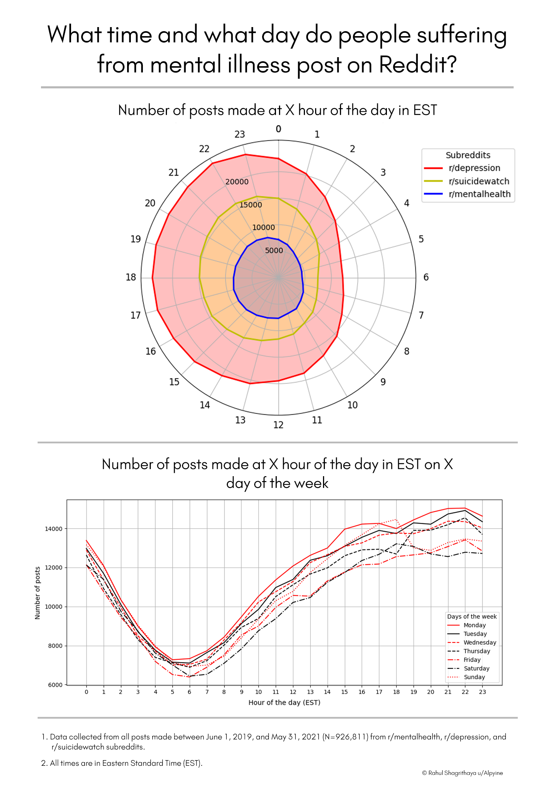

# Analysis of mental health related subreddits



<h3>How to use?</h3>

1. Install all the prerequisites using pip, preferably in a new environment:

```pip install -r requirements.txt```

2. Run the <i>extract_time_stamps.py</i> to download all the timestamps from Reddit API for the three subreddits

3. Run the appropriate python script to get the infographic for the desired data:
 - timeOfDayPosted.py (Radar graph to visualize the number of posts made at X hour of the day)
 - dayOfWeekPosted.py (Bar graph to visualise the number of posts made on X day of the week)
 - timeOfDayInWeekPosted.py (Line graph to visualize the number of posts made at X hour of the day on the X day of the week)